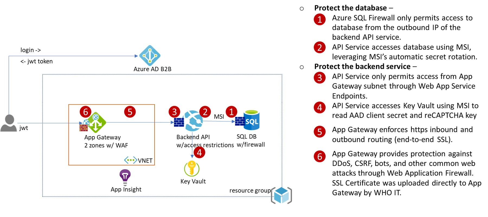

# Web API Infrastructure

[[_TOC_]]

## Deploy a new environment
Each infrastructure deployment pipeline defined in the [pipelines](..\Pipelines) folder deploys a new environment as shown below, excluding Azure AD B2C/B2B and Key Vault.
Both pipelines and documentation are based on this repo: https://github.com/liupeirong/secure-azure-web-app-deployment



### About the pipelines ###

1. All pipelines in [Pipelines](..\Pipelines) folder share the same [Azure Resource Manager (ARM) template](infrastructure-deploy.json). They only differ in the variables they use.  The fixed variables are defined in the pipeline yaml itself.  You can specify environment specific variables in the variable groups used by each pipeline.
2. No idempotency for stateless services - Each pipeline deploys a backend Web App running a default ASP.NET Core 3.1 application.  The pipelines have no knowledge of the specific requirements of our apps.  Everytime a pipeline is run, it will revert the apps to this initial state.  You need to run the CI/CD pipelines of the apps to redeploy them.
3. Idempotency for your data - The pipelines don't provision SQL database or Key Vault.  These components store your data and you need to create them yourself.  Running the pipelines multiple times will not touch data stored in these components.  
    * Each pipeline does deploy an Azure SQL Server on which you can create your own database.
5. Each pipeline dynamically generates a password for SQL Server.  Other than that, there's no secret stored or referenced in the pipeline.  Post deployment, follow the instructions below to perform a few privileged operations manually.

### Provision a dev environment from scratch ###

The steps below describe how to provision a ```dev``` environment. Steps to provision other environments are exactly same. You just need to create another variable group, and point the pipeline at that variable group.

1. Create a Service Connection in Azure DevOps (AzDO) to Azure subscription.  You must have ```Owner``` or ```User Access Administrator``` permissions on the subscription to perform this.
2. Create a resource group in Azure.  All resources will be deployed in the same region as the resource group.
3. Create a Azure DevOps Variable Group ```dev-infra-vg``` and add the following variables:
    * ```AZURE_RM_SVC_CONNECTION``` - name of the service connection created above
    * ```RESOURCE_GROUP``` - name of the resource group created above
    * ```LOCATION``` - location of the resource group and all the resources. E.g.: westeurope
    * ```TAG``` - a unique name that identifies this deployment in this resource group, use only alphabet and numbers
    * ```WEBAPPNAME``` - the web site will be accessible from ```https://WEBAPPNAME.your_resourcegroup_location.cloudapp.azure.com```
4. Manually trigger the pipeline defined by [dev-infrastructure.yaml](..\Pipelines\dev-infrastructure.yaml).

### Post deployment manual steps ###
The following steps require privileged permissions to access Key Vault and SQL DB.  Run the following commands in an Azure Cloud Shell unless otherwise specified.

**Step 1. Add a SSL certificate to Azure Key Vault, and grant access to a managed identity**

1. A managed identity is provisioned for you during the pipeline run. Go to your resource group to find its object id. Run the following command to grant read access to the managed identity. Replace ```$KEYVAULTNAME```, ```$RESOURCE_GROUP``` with your own.

```bash
az keyvault set-policy -n $KEYVAULTNAME -g $RESOURCE_GROUP --object-id $MANAGEDIDENTITY_OBJECTID --certificate-permissions get list --secret-permissions get list
```

2. Add a SSL certificate to your own Azure Key Vault, create a Key Vault if needed. The following command creates a self-signed certificate in Key Vault.  ```$MY_ACCOUNTNAME``` is typically your email address, or if you are a guest user of this AAD Tenant, then it's ```alias_company#EXT#@your_tenant.onmicrosoft.com```.

```bash
# give yourself access policy to create certificate if needed
az ad user show --id $MY_ACCOUNTNAME # get object id to use below
az keyvault set-policy -n $KEYVAULTNAME -g $RESOURCE_GROUP --object-id $MY_OBJECTID --certificate-permissions create get list --secret-permissions set get list
# create a self-signed cert
az keyvault certificate create --vault-name $KEYVAULTNAME -n $CERTNAME -p "$(az keyvault certificate get-default-policy)"
```

**Step 2. Provide the SSL certificate to App Gateway**  
These changes are needed because when the environment is provisioned we don't have the final SSL certificate. App Gateway cannot create https listener without a certificate. 

1. Add ```httpsListener``` to App Gateway by specifying https and pull the certificate from Key Vault using the managed identity:

2. Replace the ```placeholderListener``` of ```AppGatewayRoutingRule``` with ```httpsListener```.  Wait until update finishes:

3. Update ```httpToHttpsRedirect``` rule to ```httpsListener```:

4. delete the ```placeholderListener```


**Step 3. Grant backend web app access to Azure SQL**
1. Make yourself AAD admin of SQL Server
2. Add your client IP to the firewall rule of SQL Server
3. Go to Azure portal, navigate to your Azure SQL DB, log in as AAD admin.  In the Query editor, run the following TSQL query to grant backend web app access to your SQL database. Replace ```WEBAPPNAME``` with the value you specified in your AzDO variable group. **Note** if you re-create a web app with the same name, the managed identity of the new web app is not the same as the deleted web app. Run the ```DROP``` command below first.

```sql
-- DROP USER [WEBAPPNAME-backend] -- removes previous webapp of same name
CREATE USER [WEBAPPNAME-backend] FROM EXTERNAL PROVIDER
ALTER ROLE db_datareader ADD MEMBER [WEBAPPNAME-backend] -- gives permission to read to database
ALTER ROLE db_datawriter ADD MEMBER [WEBAPPNAME-backend] -- gives permission to write to database
```

4. Reset SQL Server password.  The password was auto-generated at provision time.

**Step 4. Grant backend web access to KeyVault secrets**

Replace ```$KEYVAULTNAME```, ```$RESOURCE_GROUP```, and  ```$WEBAPPNAME``` with your own.

```bash
WEBAPPSP=$(az webapp show -n $WEBAPPNAME-backend -g $RESOURCE_GROUP --query "identity.principalId" -o tsv)
az keyvault set-policy -n $KEYVAULTNAME -g $RESOURCE_GROUP --object-id $WEBAPPSP --secret-permissions get list
```

## Deploy Backend web app

See [Source README.md, section Deploying the API to Azure Web App](../Source/README.md) for details on how to use Azure Pipelines to deploy the Web API.

Verify the app runs in the URL that you can find in Application Gateway > Overview > Frontend public IP address.

## Troubleshooting

### Exposing Swagger Endpoint in a Dev Environment

In order to expose the swagger endpoint for the backend APIs in an environment, a new App Gateway Rule will need to be added.

1. Navigate to the Application Gateway Resource in the Azure Portal.
2. Navigate to `Rules`, open the `appGatewayRoutingRule`, and create a new path based rule for `/swagger/*` to target the backend web app pool.

3. Save all changes, and test out the swagger endpoint at `https://<your-app-gatey-hostname>.com/swagger/index.html`.

### Backend Web App Functionality with App Gateway
Currently the App Gateway is deployed with one backend pool for the backend web application. Routing traffic to this pool is determined by the URL path, all paths that fall under `https://appgatewayhostname/api/*` will be routed to the backend web application.. For example, `https://appgatewayhostname/api/` will route to `https://backendwebapp/api/`, and `https://appgatewayhostname/api/requests/` will route to `https://backendwebapp/api/requests`.

In order for this routing to work, the root endpoint (`https://backendwebapp/`) of the backend web app must be implemented. If it is not, the health probe for the backend pool on the app gateway will fail, and all routing to the backend web app will give a 502 error.

The backend web app can only be accessed through the App Gateway.  If you need direct access to the web app for troubleshooting, you can delete the access restrictions on the web app, and add them back when you are done.

### Setup the Subscription to allow use of Managed Identity.

Your deployment will fail if your Azure subscription doesn't have the managed identity provider registered.  You must be the 'Owner' of the subscription to perform this. Run the following in Azure Cloud Shell:

```bash
az provider register -n Microsoft.ManagedIdentity
```

### App Gateway multi-zone

Not all Azure regions support App Gateway multi-zone deployment. If the region you are deploying to doesn't support multi-zone, modify the ARM template to use single zone.

### Proper sizing of the App Service Plan

The App Service Plan runs the backend web site.  Currently it's using the ```P1V2``` SKU which has 3.5GB memory.  If the site starts to throw a lot of errors, check CPU and memory of the App Service.
