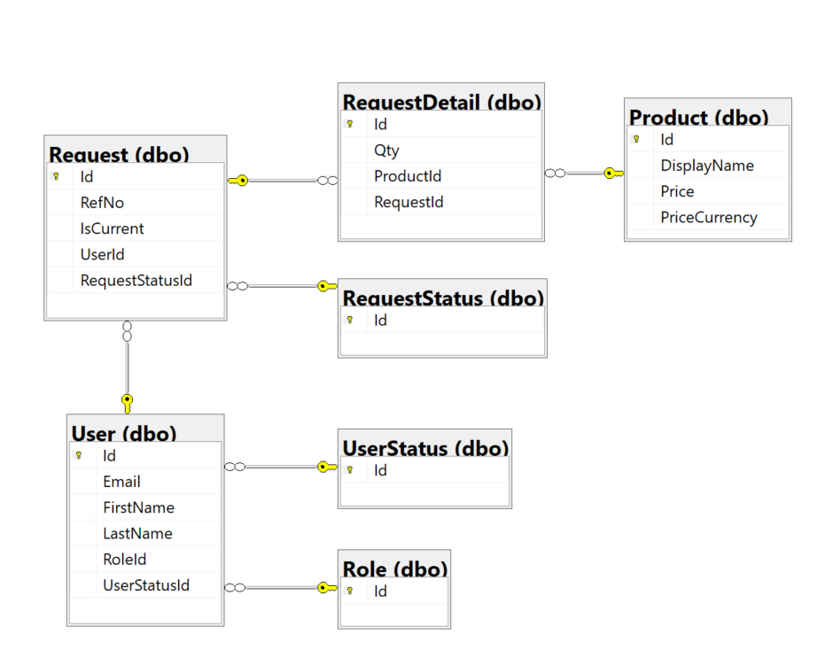

# WebAPI sample project

[[_TOC_]]

## Introduction

This project is an example that shows how to create a Web API with ASP.NET Core 3.1 that supports B2B/B2C authentication and role-based authorization, that uses Entity Framework Core code-first to store additional user information, role information and data in an Azure SQL Server database, that supports Swagger, API Versioning, telemetry with Azure Application Insights, etc. See [main features section](#main-features) for additional details.

The API includes a couple of controllers to show how we could add new users and their role information to the database and how those users could create requests for products (which are already stored in the database). Methods to get, update and delete information are provided for completion. The role of the user (User, Coordinator or Admin) will determine the operations she can perform e.g. an Admin can manage users but not requests, a User can create requests, and a Coordinator can manage requests but not users.

The project also contains Azure Resource Manager (ARM) templates, scripts, Azure Pipelines for Azure Dev Ops and documentation to create and configure the required infrastructure, to build and test the API and to deploy it to that infrastructure.

This API has been developed with C#, Visual Studio 2019 and Windows 10. But ASP.NET Core is cross-platform, so this API should also run on Mac and Linux, and we might have used e.g. Visual Studio Code as our development tool instead of Visual Studio 2019.

## Folder structure

This is the main folder structure of the solution:
```
\ -> This readme and .gitignore file.
\ArmTemplates -> Azure Resource Manager templates and scripts to deploy the required infrastructure to run this API in Azure.
\Pipelines -> Azure Pipelines to deploy the infrastructure to dev, staging and production environments, and to build, test and deploy the API to the infrastructure on those environments.
\Postman -> Postman collection to try the API.
\Source -> Visual Studio 2019 solution.
\Source\ReCaptchaClient -> Simple frontend that we can use to get a ReCaptcha token that the API can validate.
\Source\Rules -> Ruleset for the linter (StyleCop).
\Source\WebAPI -> API implementation.
\Source\WebAPI.IntegrationTests -> Integration tests for the API.
\Source\WebAPI.Tests -> Unit tests for the API.
```

This is the folder structure of the WebAPI project:
```
\ -> Project file, settings and global setup (e.g. authentication, versioning, Swagger) of the API.
\Constants -> Fixed ids and strings from the database.
\Controllers -> API controllers implementing version 1 endpoints (version 1 is the current default version).  
\Controllers\V2 -> API controllers implementing version 2 endpoints.
\Controllers\Helpers -> Helper methods to use in controllers.
\Formatters -> CSV output formatters.
\Helpers -> Helper methods to use in the API.
\Migrations -> Entity Framework Core Migrations (auto generated code).
\Model -> Classes representing project settings.
\Model\Database -> Classes representing the database context, tables and their relationships.
\Model\Requests -> Classes representing the input data for the different endpoints.
\Model\Responses -> Classes representing the output data for the different endpoints.
\Properties -> Visual Studio settings to launch the project.
```

## Database schema

As you can see below, the database schema used for this sample application is very basic. Obviously, it would be possible and useful to have additional information in each table, depending on the specific context (i.e. Description, DisplayName, etc).


## Main Features

### Static Code Analysis Tool

We use **StyleCop** for static code analysis.
The shared **Rules** configuration can be found in [ProjectRuleSet.ruleset](\Source\Rules\ProjectRuleSet.ruleset).
The **suppression** of specific errors for the project can be found in [GlobalSuppressions.cs](\Source\WebAPI\GlobalSuppressions.cs).
A sample to disable a warning for a specific line of code can be found in [MSGraphService.cs](\Source\WebAPI\Services\MSGraphService.cs).

### Unit tests

We use [XUnit](https://xunit.net/) for unit testing the API.
The main library used for **assertions** is called [FluentAssertions](https://fluentassertions.com/introduction).
For **code coverage** we use [coverlet.msbuild](https://github.com/coverlet-coverage/coverlet) so that we can also create the code coverage report in the Azure Pipeline and visualize it in Azure DevOps.
In some tests we use [Moq library](https://github.com/moq/moq4) to **mock** different services.
Each unit test creates its own [Entity Framework Core In-memory database](https://docs.microsoft.com/en-us/ef/core/providers/in-memory/?tabs=dotnet-core-cli) to be able to test the APIs.
Check [WebAPI.Tests project](Source\WebAPI.Tests\WebAPI.Tests.csproj) for more details.

### Integration tests

In a similar way to Unit Tests, we use **XUnit**, **FluentAssertions**, **Moq** libraries and the **Entity Frameork Core in-memory database**.
Here all the tests share the same database.
Check [CustomWebApplicationFactory.cs](Source\WebAPI.IntegrationTests\Common\CustomWebApplicationFactory.cs) to understand how we **fake JWT authentication** and replace the Azure SQL Database with the in-memory database for the tests.
For more details you can check [WebAPI.IntegrationTests project](Source\WebAPI.IntegrationTests\WebAPI.IntegrationTests.csproj).

### Database access

To access the database we use [Entity Framework Core](https://docs.microsoft.com/en-us/ef/core/) and we follow the [code-first approach](https://entityframeworkcore.com/approach-code-first) to create the database based on our [class model](Source\WebAPI\Model\Database).
We used [Migrations](https://docs.microsoft.com/en-us/ef/core/managing-schemas/migrations/?tabs=vs) to update the database schema based on the changes in our class model. Migrations related files can be found in the [Migrations folder](Source\WebAPI\Migrations).
When developing locally we enabled the **logging** to be able to check e.g. the T-SQL statemets that Entity Framework uses behind the scenes to interact with the database. Check [Source README.md](Source\README.md) for more details.

### API Versioning

We added support to different [versions of the APIs](https://github.com/microsoft/aspnet-api-versioning) in [Startup.cs](Source\WebAPI\Startup.cs).
By **default** all the controllers are set to version 1, but we created [version 2](Source\WebAPI\Controllers\V2) of a specific controller.
Note that we also added API versioning support to the Error Handler and Swagger, as explained below.

### Error handling

We set up a **default Error Handler** in [Startup.cs](Source\WebAPI\Startup.cs).
The controller that handles the error can be found in [ErrorController.cs](Source\WebAPI\Controllers\ErrorController.cs). This controller supports any version of the APIs (**ApiVersionNeutral**).
As our APIs may return errors with additional information in ProblemDetails, we created [CustomProblemDetails.cs](Source\WebAPI\Model\Responses\CustomProblemDetails.cs) so that Swagger can document them properly.
For more information check the official documentation: [Handle errors in ASP.NET Core web APIs](https://docs.microsoft.com/en-us/aspnet/core/web-api/handle-errors?view=aspnetcore-3.1).

### Cross Origin Resource Sharing

**Cors** configuration can be found in [Startup.cs](Source\WebAPI\Startup.cs).

### Naming strategy for JSON output

For both input and output json of the APIs we changed the naming strategy from default camel case (e.g. `RefNo`) to **snake case** (e.g. `ref_no`). Check [Startup.cs](Source\WebAPI\Startup.cs) for the details.

### CSV output formatter

Some of the APIs can return data as **CSV** file, so we created [CsvOutputFormatter.cs](Source\WebAPI\Formatters\CsvOutputFormatter.cs) and we added support to CSV in [Startup.cs](Source\WebAPI\Startup.cs). An example of an API returning a CSV can be found in [RequestsController.cs](Source\WebAPI\Controllers\RequestsController.cs).

### Response caching

Every [controller](Source\WebAPI\Controllers) disables the [caching of the responses](https://docs.microsoft.com/en-us/aspnet/core/performance/caching/response?view=aspnetcore-3.1) using the **ResponseCache attribute**.

### B2C/B2B authentication

The APIs support both **B2B** and **B2C** authentication and the configuration can be found in [Startup.cs](Source\WebAPI\Startup.cs).
By default all the APIs require authentication. If an API does not require it then it must specify the **AllowAnonymous attribute**.
Check [Setup Azure B2B and/or B2C section](#setup-azure-b2b-andor-b2c) in this file and [Source README.md](Source\README.md) for more details about the configuration.

### Role based authorization

Information about the users and their roles are stored in the database. We created [ConfigureJwtBearerOptions.cs](Source\WebAPI\ConfigureJwtBearerOptions.cs) to add a **Role Claim** to an authenticated user based on the information in the database, after validating her JWT Token. The class in this file is then used in [Startup.cs](Source\WebAPI\Startup.cs).
Every API which requires a specific role to be called uses the **Authorize attribute**. If it needs to check the role during its execution, then the **IsInRole method** is used.
For more details check the different [controllers](Source\WebAPI\Controllers) and the official documentation: [Role-based authorization in ASP.NET Core](https://docs.microsoft.com/en-us/aspnet/core/security/authorization/roles?view=aspnetcore-3.1).

### Invite users to B2B

We created the [MSGraphService.cs](Source\WebAPI\Services\MSGraphService.cs) so that the API is able to send invites for **B2B guest users** to join the Azure Active Directory. The set up is in [Startup.cs](Source\WebAPI\Startup.cs) and a sample of the usage is in [UsersController.cs](Source\WebAPI\Controllers\UsersController.cs).
Note that this service sends the invitation using the JWT Token of the user calling the API.

### ReCaptcha validation

To ensure that an anonymous API is not called by a BOT, we created the [ReCaptchaService.cs](Source\WebAPI\Services\ReCaptchaService.cs) to **validate the recaptcha payload / token** provided by the client calling the API.
The set up is in [Startup.cs](Source\WebAPI\Startup.cs) and a sample of the usage is in [UsersController.cs](Source\WebAPI\Controllers\UsersController.cs).
We also created a simple [client application](Source\ReCaptchaClient) to generate the recaptcha payload / token.

### Swagger support

[Swagger](https://docs.microsoft.com/en-us/aspnet/core/tutorials/getting-started-with-swashbuckle?view=aspnetcore-3.1&tabs=visual-studio) is configured and enabled in [Startup.cs](Source\WebAPI\Startup.cs). We added **JWT authentication** support to be able to try protected APIs in Swagger UI. Specific configuration to support **API versioning** can be found in [ConfigureSwaggerOptions.cs](Source\WebAPI\ConfigureSwaggerOptions.cs).
Note that we added support to **Newtonsoft.json** in Swagger because we had to use Newtonsoft in the controllers to change the naming strategy to snake case.

### Telemetry

**ApplicationInsights** support is set up in [Startup.cs](Source\WebAPI\Startup.cs).

### Secrets

We use **Azure Keyvault** to store some secrets. [Program.cs](Source\WebAPI\Program.cs) provides the set up to use them in production.


# Getting Started

## Setup Azure B2B and/or B2C

To setup the Azure environment for B2B and/or B2C authentication you can follow the instructions in https://github.com/liupeirong/react-aspnetcore-graph-b2b-or-b2c.

## Setup Azure KeyVault

To setup Azure KeyVault you can follow the instructions in [Quickstart: Set and retrieve a secret from Azure Key Vault using Azure CLI](https://docs.microsoft.com/en-us/azure/key-vault/secrets/quick-create-cli).

## Deploy infrastructure

Details on how to use Azure Pipelines to deploy infrastructure in dev, staging and production environments, and how to configure that infrastructure are provided in [ArmTemplates README](..\ArmTemplates\README.md).

## Build, Test, Deploy, Run and Debug the API

Details can be found in [Source README](..\Source\README.md).

# Contribute

By contributing in this project, you agree to abide by the [Microsoft Open Source Code of Conduct](https://opensource.microsoft.com/codeofconduct/).

## Branch policy

This project follows the [GitHubFlow Workflow](https://help.github.com/en/github/collaborating-with-issues-and-pull-requests/github-flow). Branches should be named descriptively using the following convention:

* personal branches: `user/your_alias/feature_name`

Pull requests need at least two reviewers and everyone in the team can equally act as reviewer (no explicit component ownership). If there is specific need for a specific person to review, it is the pull request author's responsibility to ask review from that specific person.

All pull requests must have a linked Issue/Work Item.

## Design Guidelines

When working with .NET Framework and C#, we must follow the official [Framework Design Guidelines](https://docs.microsoft.com/en-us/dotnet/standard/design-guidelines/) for naming, types, member design, extensibility mechanisms, exceptions, usage of common types and common design patterns.
